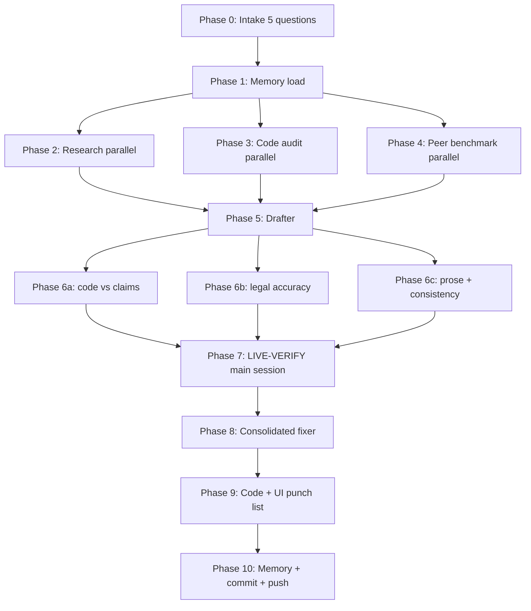

<div align="center">

<!-- Banner - replace banner.png with the image you generate -->


<h1>compliance-auditor</h1>

<h3>The first Claude Skill that reads your codebase before it writes your Privacy Policy.</h3>

<p>
Multi-agent compliance workflow for vibe coders and early-stage founders.<br>
Generates legally-grounded Privacy Policy, Terms of Service, and compliance artifacts that actually match what your app does.
</p>

<p>


</p>

<p>
<a href="#what-it-does"><strong>What it does</strong></a> .
<a href="#how-it-works"><strong>How it works</strong></a> .
<a href="#install"><strong>Install</strong></a> .
<a href="#quickstart"><strong>Quickstart</strong></a> .
<a href="#supported-jurisdictions"><strong>Jurisdictions</strong></a> .
<a href="#vs-alternatives"><strong>vs. Alternatives</strong></a> .
<a href="#not-legal-advice"><strong>Not legal advice</strong></a>
</p>

</div>

---

> **Not legal advice.** This skill is an AI-powered document-drafting assistant. The policies, agreements, and assessments it generates are produced in a fully automated manner from your inputs and should be understood as first-draft working documents, not as legal advice. They do not substitute for review by an attorney licensed in your jurisdiction(s). You remain solely responsible for the accuracy, completeness, and legal suitability of any document you publish. Before relying on output from this skill, have it reviewed by qualified counsel. No attorney-client relationship is formed by your use of this skill.

---

## Why another one?

Every privacy-policy tool on the market - open-source and SaaS - is a template-and-questionnaire engine. You answer form questions. It swaps strings into pre-vetted clauses. You paste the HTML into your footer. It never reads your code. It never knows you swapped Mixpanel for PostHog last week. It never tells you that Supabase is not DPF-certified but Vercel is. It ships fast and breaks quietly.

Real compliance is not a form. It is:

1. Knowing which third parties actually see user data (a code audit).
2. Knowing which regulators actually apply to your users (primary-source research).
3. Knowing how mature peers handle the same data flows (peer benchmark).
4. Writing precise prose that survives three kinds of review (code vs. claims, law vs. citation, writing vs. clarity).
5. Committing the result into your repo alongside a memory rule so the next session does not silently drift out of compliance.

This skill does all five.

## What it does

### You run it on your app and get:

- **`app/.../privacy/page.tsx`** - your rendered Privacy Policy page, accurate to the data flows it found in your code
- **`app/.../terms/page.tsx`** - your Terms of Service, with the right governing law, consumer carve-outs, and acceptable-use rules
- **`specs/legal/PRIVACY-POLICY.md`** + **`specs/legal/TERMS-OF-SERVICE.md`** - canonical source versions kept in sync with the rendered pages
- **`specs/legal/research-{date}.md`** - full primary-source citation pack (EDPB, ICO, CPPA, FTC, Israeli PPA, Google Limited Use, Meta, RFC 8058) scoped to your jurisdictions
- **`specs/legal/data-practices-audit-{date}.md`** - the factual code audit with file:line evidence for every claim
- **`specs/legal/benchmark-peers-{date}.md`** - clause-level comparison against 5 peer SaaS companies
- **`specs/legal/review-6[abc]-{date}.md`** - the three parallel-reviewer reports
- **`specs/legal/code-ui-punch-list-{date}.md`** - a concrete todo of code + UI changes your app needs to actually match what the docs promise
- **`memory/legal-docs-update-rule.md`** - a memory rule that tells future Claude sessions exactly when and how to update the policy

### And it DOES NOT:

- Copy boilerplate from a template library
- Invent mailboxes (`privacy@`, `legal@`, `noreply@` - no, never)
- Claim user rights you haven't built (no "self-service data export" unless the endpoint exists)
- Cite a regulator you're not exposed to
- Leave you without a review trail

## How it works

The skill is a deterministic 10-phase pipeline. Three Phase-1 agents run in parallel; three Phase-3 reviewers run in parallel; everything else is sequential.



### The six agents and their tools

| Phase | Agent | Skill loaded | Why |
|---|---|---|---|
| 2. Research | `researcher` | `parallel-web-search` | Primary-source regulator reading |
| 3. Audit | `code-analyzer` | - | Grep your repo for real data flows |
| 4. Benchmark | `researcher` | `parallel-web-search` | Reverse-engineer 5 peer policies |
| 5. Drafter | `coder` | `elements-of-style:writing-clearly-and-concisely` | Plain-English legal prose |
| 6a. Code vs claims | `security-auditor` | `security-review` | Verify each claim in code |
| 6b. Legal accuracy | `researcher` | `parallel-web-search` | Verify each statement of law |
| 6c. Prose + style | `reviewer` | `elements-of-style:writing-clearly-and-concisely` | Em dashes, consistency, a11y |
| 8. Fixer | `coder` | - | Consolidate all review findings |

## Install

### Claude Code

```bash
# Clone anywhere under ~/.claude/plugins/cache/ or your skills folder
cd ~/.claude/skills
git clone https://github.com/{YOUR_HANDLE}/compliance-auditor.git

# Or point your plugin config to this repo
# Then in a Claude Code session:
#   "Use the compliance-auditor skill to rewrite my privacy policy"
```

### Cursor, Windsurf, Codex CLI, Cowork

Drop the `compliance-auditor/` folder into the tool's skills directory. See each tool's "custom skill" install docs.

### Standalone (Claude.ai desktop)

Upload the folder as a knowledge source. The skill will operate in non-parallel mode (sequential phases); it still works but slower.

## Quickstart

In a Claude Code session inside your project:

```
Use the compliance-auditor skill to audit and rewrite my privacy policy and terms of service.
```

That's it. The skill will:

1. Show you the disclaimer and wait for your acknowledgement.
2. Ask five intake questions.
3. Launch three parallel agents (research + code audit + peer benchmark).
4. Draft.
5. Run three parallel reviewers.
6. Handle any LIVE-VERIFY items itself.
7. Apply consolidated fixes.
8. Write the memory rule.
9. Commit and push (with your confirmation).

Expect 30-90 minutes of wall time in a well-tooled environment. Most of it is research; you can step away.

## Supported jurisdictions

**Out of the box:**

- EU GDPR (Regulation 2016/679)
- UK GDPR + DPA 2018
- California CCPA / CPRA (including the 11 enumerated PI categories + SPI + ADMT future-proofing)
- US COPPA (children under 13)
- Israel PPL (Amendment 13, in force August 2025)
- EU ePrivacy / PECR (cookies + soft opt-in marketing email)
- Google API Services User Data Policy (Limited Use - verbatim four exceptions)
- Meta / WhatsApp Business Platform
- CAN-SPAM + RFC 8058 one-click unsubscribe
- EU AI Act (2024/1689) touchpoints
- WCAG 2.2 AA / EAA / ADA Title III (accessibility)

**Available on request** (cite these in intake and the skill will research them):

- Brazil LGPD, Canada PIPEDA / Quebec Law 25, Australia Privacy Act, Switzerland FADP, Singapore PDPA, Japan APPI, South Africa POPIA

**Out of scope** (skill will REFUSE and redirect to specialist counsel):

- China PIPL, India DPDP Act - jurisdiction-specific rules beyond what's in the primary-source library
- Heavily regulated domains: HIPAA-PHI, GLBA, PCI-DSS, SOX, FERPA, COPPA-plus
- Active litigation, DSAR deadlines, or regulator inquiries

## vs. alternatives

| | compliance-auditor | Termly / Iubenda / FreePrivacyPolicy | nisrulz/app-privacy-policy-generator | Anthropic legal plugin |
|---|---|---|---|---|
| Reads your codebase | **Yes** | No | No | No |
| Cites primary-source regulators | **Yes (with URLs)** | No (black-box) | No | Review only |
| Peer-benchmarks against 5 real SaaS | **Yes** | No | No | No |
| Three parallel reviewers | **Yes** | No | No | - |
| Commits to your repo | **Yes** | No (hosts HTML on their server) | Download + paste | No |
| Writes memory rule for future sessions | **Yes** | No | No | No |
| Generates code + UI punch list | **Yes** | No | No | No |
| Price | Free / MIT | $0-$20/mo (+$10k/yr for OneTrust) | Free (static form) | Free / Apache-2.0 |

## What it actually catches

From the real-world run that built this skill (a small-team SaaS, `mark-it.co`):

- Old policy named **5 sub-processors.** Actual code used **12.** (Apify, Jina Reader, weserv.nl, WaSender, Telegram all undisclosed.)
- Old policy promised **self-service data export.** No such endpoint existed.
- Old policy claimed **account deletion cascades everywhere.** Bot-audit and engagement tables had `ON DELETE SET NULL`, not `CASCADE` - orphaned rows survived deletion.
- Old policy **paraphrased Google Limited Use** exceptions. Paraphrase invalidates Google's OAuth annual audit. Fixed to verbatim quotes.
- Old policy stated **"WhatsApp STOP works bilingually."** Code accepted only English `stop`. Fixed to say exactly what works.
- Old policy described WhatsApp phone as **"hash + masked form only."** Code still read `phone_raw` in two places. Fixed to disclose the transition.
- 0 em dashes in shipped files (project rule).
- TypeScript clean.
- Signup consent moved from below the button to above (sign-in-wrap per Meyer v. Uber precedent).
- CAN-SPAM physical address added to every engagement email footer.

## The disclaimer (shortest version)

**I am not your lawyer. This skill is not your lawyer. The output is a first-draft working document.** Review by qualified counsel in your jurisdiction is non-negotiable before you ship to production. The primary-source citations help your attorney's review. They do not replace it.

## Contributing

PRs welcome on:

- Additional jurisdictions (add a section to `references/jurisdictions.md` with the requirement list + primary-source URLs)
- Additional third-party SDK patterns in `scripts/find-data-flows.sh`
- Peer-set templates for new product categories in `references/peer-benchmarking.md`
- New review lanes (an a11y-specialist reviewer, for example)

Please do NOT submit PRs that:

- Add template-copy language without primary-source citation
- Relax the disclaimer posture
- Add jurisdiction-specific rules without a URL to the regulator's primary source

## Credits and prior art

This skill draws structurally from the industry-standard sign-in-wrap patterns used by **Stripe, Notion, Vercel, Linear, Raycast, Readwise,** and **Figma**, and from the sub-processor-page pattern pioneered by **Notion** and **Supabase**. Legal-engineering inspiration: **Fieldfisher Privacy blog, CMU CyLab Privacy Engineering, Stanford CodeX,** and the **GDPR Enforcement Tracker.**

Disclaimer language adapted from **Iubenda** (which we recommend crediting, however loosely we've restated).

## License

MIT. See [LICENSE](./LICENSE).

Use it, fork it, improve it, ship it. Just keep the disclaimer.

---

<div align="center">
  <sub>Built by vibe coders, for vibe coders. The law is a first-class citizen of the build system now.</sub>
</div>
